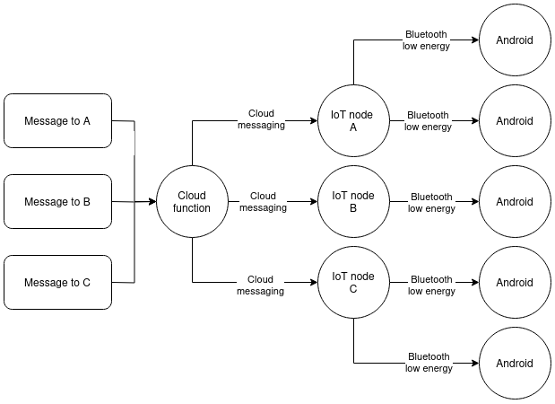

---
header-includes:
  - \usepackage{graphicx}
  - \usepackage{geometry}
  - \geometry{a4paper, margin=1in} # Adjust the margins as needed
  - \setkeys{Gin}{width=\linewidth, height=\textheight, keepaspectratio} # Fit images to page width and height
---

# Computer Networks / Components of IoT Application

Student name:

Email address:

## Week 1

### 1. Define following terms and concepts shortly:

- Network bandwidth:
    - The theoretical data transfer rate capacity of the network.
- Network throughput:
    - The actual amount of data that can be transferred through the network.
- Packet loss and jitter:
    - Packet loss is loss of data packets during transmission. Jitter is the variation in latency between two systems.
- bps vs Bps:
    - bps stands for bits per second while Bps stands for bytes (8 bits) per second
- Protocol payload:
    - The actual data being sent over a protocol (headers excluded).
- Protocol overhead (especially for resource-contrained IoT purposes):
    - The additional data in the packets the protocol requires, like headers.
- Spanning Tree Protocol:
    - A protocol that allows creating redundant loops between switches by disabling links between them.
- Collision domain:
    - A network segment where simultaneous data transmissions collide.
- Broadcast domain:
    - A logical division of a computer network where all nodes can reach each other by broadcast at the data link layer.
- SOHO network:
    - SOHO network stands for "Small Office/Home Office network". A type of local network designed for small offices. Mainly used for connecting several computing devices to share data effectively.
- MAC (physical) address:
    - MAC address stands for "medium access control address". It is a unique identifier used to identify network interface controllers in a network.
- Physical layer protocol data unit (PDU):
    - The data unit (a single unit of information) of the physical layer; a bit, or more generally, symbol.
- MAC layer protocol data unit (PDU):
    - The data unit on the MAC layer (link layer); a frame.
- Half-duplex vs Full-duplex:
    - In half-duplex a node can either receive or send data at any given time, while in full-duplex a node can send and receive at the same time.
- Ethernet auto-negotiation:
    - A technique that allows two connected devices to choose common transmission parameters like speed, duplex mode and flow control.
- Hidden node problem (wireless):
    - A situation where a transmittin node A does not know about another node B when transmitting to node C, which is in range of both A and B, resulting in collisions when both A and B attempt to transmit to C at the same time, because they are not aware of each other.
- Networking physical vs logical topology:
    - Physical topology is the actual physical arrangement of elements of a network. Logical topology describes the logical layout of the network and how data is transmitted between network nodes.
- TIA/EIA-568 and ISO/IEC_11801:
    - TIA/EIA-568 is a standard which defines structured cabling system standards for commercial buildings. ISO/IEC_11801 is the international standard for Generic Cabling for Customer Premises.
- Ethernet cabling categories. For example, CAT 6:
    - Ethernet cables fall into different categories like Cat 6 or Cat 5 which have different properties, maximum data rates and frequencies.
- 8P8C (RJ45):
    - A type of connector found in ethernet cables for example. 8P8C refers to the pins found in the connector, 8 Position 8 Contact.
- Wifi AD HOC:
    - A type of Wifi network that is decentralized, where each node participates in routing by forwarding data to other nodes.
- IEEE 802.11ac, 802.11ax, 802.11be:
    - WLAN standards, with 802.11be (aka Wifi 7) being the latest, 802.11ax (Wifi 6) being the second newest and 802.11ac (Wifi 5) being the oldest of the three.

### 2. Estimate how long does it take to download 3 TB file from cloud based backup service if network download throughput is 200 Mbps for actual payload (i.e. data)?

Payload is 3TB in total, which in bits is:<br>

`8 * 3Tb = 24Tb`

`24Tb = 24 000 000Mb`

Divide by throughput:

`24 000 000Mb / 200Mbps = 120 000s = 33h 20m`

### 3. Locate the MAC address of your mobile phone, laptop wifi interface or some other networked IT device.

- How did you find it: <br>
    - I found the MAC address of my Android phone in Settings -> About phone
- List the MAC address in hex format (such as f0:1f:af:cf:d9:1a), but replace last 24 bits with zeros for your privacy: <br>
    - 64:a2:f9:00:00:00
- Use OUI MAC address list(s) or lookup tools, and determine the device/chipset vendor of that MAC address. For example, that f0:1f:af:cf:d9:1a is Dell inc.: <br>
    - OnePlus Technology (Shenzhen) Co., Ltd

### 4. Describe shortly what are these network devices, functions, and services

- Repeater
    - Repeaters are devices that amplify signals they receive.
- Hub (multiport repeater)
    - A device that forwards received packets to all connected devices.
- Bridge
    - A device that bridges together networks as if they were a single network.
- Access switch
    - A switch located at the edge of a network. Provides end-user devices access to the network.
- Core switch
    - A switch at the center of the network, connecting other switches and routers together.
- Edge router
    - A router that is at the edge of the network. Focuses on routing between different networks.
- Core router
    - A router that focuses on routing within the same network.
- Firewall
    - A network security system that monitors and controls incoming and outgoing network traffic.
- Wifi AP
    - Wifi Access Point is a device that allows other devices to connect to a network.
- WLAN AP controller
    - A device that coordinates multiple access points.
- Network TAP
    - A network Test Access Point is a device that is placed between devices in the network to monitor the traffic.

### 5. RFC assignments

- What are RFCs?
    - Technical documents issued by the Internet Engineering Task Force which describe specifications, procedures and standards.
- How many PPP related RFC documents can you find from rfc-editor website?
    - 111
- What is the current status of RFC1597? What is the number for updated, more recent RFC of same topic?
    - Status: INFORMATIONAL
    - The updated one is: RFC 1918
- When was RFC5218 released?
    - July 2008
- What is the meaning if RFC status is BCP?
    - Best Current Practice, meaning it has been accepted as the best practice that should be followed.
- List authors of the CoAP RFC (June 2014). What is the RFC number?
    - Authors: Z. Shelby, K. Hartke, C. Bormann
    - RFC number: 7252
- Twitch.tv provides IRC access to the stream chats. Which RFC defines the original Internet Relay Chat (IRC) Protocol?
    - RFC 1459

### 6. What is OSI model? Compare OSI model to TCP/IP model

OSI stands for Open Systems Interconnection and TCP/IP stands for Transmission Control Protocol/Internet Protocol. These models work as frameworks for organizing how data moves from one device to another in networks.

OSI model describes networks in 7 layers:

| Layer | Function |
| -     | -        |
| Application | Providing network services to user applications |
| Presentation | Data formatting (encoding/decoding, compression/decompression, encryption/decryption) |
| Session | Controlling connections between sender and receiver |
| Transport | Ensuring reliable data transfer (error correction, flow control) |
| Network | Data transfer between networks |
| Data link | Data transfer between nodes in a network |
| Physical | Transmitting bits over physical medium |

TCP/IP model describes networks in 4 layers:

| Layer | Function |
| -     | -        |
| Application | Providing network services to user applications, data formatting and connection management |
| Transport | Providing end to end communication and data flow control |
| Internet | Data transfer in the network |
| Access layer | Physical transmission of data between devices |

Both models describe how data is transmitted between two devices in a network. Both models also define a set of layers, where data is encapsulated at each layer at the sender side and then decapsulated at the corresponding layers on the receiving side.

Despite these core similarities, the models differ in the sense that the OSI model is not tied to any specific set of protocols, while TCP/IP is closely associated with a suite of protocols including IP, TCP, UDP and others.

Out of these two models, TCP/IP has gained widespread adoption, while OSI model is primarily used for educational purposes and as a reference.

## Week 2

### 7. What are VLANs and IEEE 802.1q

VLANs (Virtual Local Area Networks) are virtual networks that group together devices that share a physical LAN and isolate them from other devices in that LAN.<br>
IEEE 802.1q is the networking standard that describes these virtual networks.

### 8. Define following terms and concepts shortly:

- ARP
    - A communication protocol used for discovering the physical addresses of devices associated with their internet layer addresses, like an IPv4 addresss.
- ARP spoofing
    - A technique where a device sends spoofed ARP messages to a local area network with the aim of associating that device's MAC address with another device's IP.
- HOP (networking)
    - An event where a packet is passed from one network segment to the next.
- IP TTL
    - IP TTL (Time to Live) is a header field and value which specifies the maximum number of hops the IP packet can traverse on layer three. This value is decremented with each hop and the packet is discarded once it reaches 0.
- IP TOS (DSCP)
    - Type of Service, Differentiated Services Code Point. Fields in an IP header for categorizing traffic based on priority and quality of service.
- DHCP, DHCP relay
    - DHCP (Dynamic HostConfiguration Protocol) is a protocol for automatically assigning IP addresses to the devices on the network.
- WoL (Wake-on-LAN)
    - A packet which a network administrator can use to wake up a device on the network, if the device supports the protocol.
- UPnP
    - UPnP (Universal Plug and Play) is a set of protocols that permits network devices to discover each other on a network and establish network services with each other.
- Traceroute / Tracepath
    - Command line tools that show the path traffic takes to reach the designated endpoint and the delays that occur at each stop.
- Network Address Translation (NAT)
    - NAT (Network Address Translation) is a service that translates private IP addresses to public ones and vice versa.
- Tier 1 and 2 networks
    - Tier 1 network is a network that can reach every other network on the internet without paying for transit or peering. Tier 2 networks pay for transit to reach
- Tier 3 ISP
    - ISP's that sell internet connections to end users. They pay for transit and peering to higher tier network operators.
- Routing Autonomous System (AS or ASN for BGP)
    - A protocol for routing packets in decentralized WiFi networks.
- 127.0.0.1 address
    - The loopback address in IPv4. Everything routed to this address loops back to the network card that sent the packets.
- ::1 address
    - The loopback address in IPv6.
- 0.0.0.0/0 and ::/0 networks in the routing table
    - Special IP address that covers all addresses.
- Ranges of IPv4 multicast and experimental addresses
    - Multicast: 224.0.0.0 - 239.255.255.255
    - Experimental: 240.0.0.0 - 255.255.255.255

### 9. Search some information about AS1741

- Which organisation or company advertises AS1741 with BGP?
    - CSC - Tieteen tietotekniikan keskus Oy
- List some public peering exchange points the AS1741 connects to?
    - NORDUnet, Hurricane Electric LLC, GlobalConnect AB
- To which regional internet registry (RIR) the AS1741 belongs to?
    - RIPE NNC, which is the regional Internet registry for Europe, Middle East and parts of Central Asia
- What is the contact email address/phone/web form if you would need to inform some security or abuse issues to the owner of the AS1741?
    - abuse@funet.fi

### 10. What is the difference between static and dynamic routing? Use example(s)

In static routing an administrator manually writes the routing table and defines a single preferred route for traffic to reach a given destination.
In dynamic routing algorithms are used to generate the routing tables automatically.

### 11. Describe briefly these dynamic routing protocols

- RIP
    - Dynamic routing protocol that uses hop coutn as a routing metric to find the best path.
- OSPF and IS-IS
    - OSPF (Open Shortest Path First) routes IP packets within an autonomous system. It uses link state advertisements to build a topology of the network, which routers use to find the shortest path to each destination. IS-IS is similar to OSPF but it doesn't require IP connectivity and runs on layer 2 instead of the IP layer.
- BGP
    - Border Gateway Protocol is designed to exchange routing and reachability information among autonomous systems on the internet.
- RPL (ripple)
    - RPL is a routing protocol for wireless networks with low power consumption.

### 12. Create a DNS request (any tool such as ping, nslookup, whatever) to resolve the IP address of www.oamk.fi

- Use some IP whois lookup web service to resolve which company is hosting and has that IP address and server? (www.oamk.fi)
    - Ping gives me the IP address 95.217.107.33 which according to whois.com belongs to "Hetzner Online GmbH"
- What is the inetnum or route/network (IP address range) the www.oamk.fi's IP address belongs to?
    - 95.216.0.0 - 95.217.255.255
- What is abuse contact email address of that network range?
    - abuse@hetzner.com

### 13. Use traceroute (tracert in MS Windows command shell) to www.whitehouse.gov

- What is the internet service provider's first router IP address near you? (it's most likely the 2nd router/hop, immediately after your home network)
    - 10.43.208.66
- How many hops (routers) are there to the www.whitehouse.gov from your device?
    - I can't tell. Routers on the way are configured not to respond to traceroute requests and all I get after hop 7 is timeouts:

```console
traceroute to www.whitehouse.gov (192.0.66.168), 30 hops max, 60 byte packets
 1  dna.wifi (192.168.1.1)  2.119 ms  2.143 ms  2.033 ms
 2  10.43.208.66 (10.43.208.66)  10.793 ms  22.122 ms  21.780 ms
 3  * * *
 4  * * *
 5  inet-sr2x.o.dnaip.fi (62.78.106.251)  14.682 ms  14.619 ms  14.171 ms
 6  * * *
 7  netnod-ix-ge-a-sth-1500.automattic.com (194.68.123.63)  21.602 ms  21.199 ms  24.041 ms
 8  * * *
 9  * * *
 ...
29  * * *
30  * * *
```

- Use traceroute again, but this time to Google's public DNS server in 8.8.8.8, and Quad9 DNS in 9.9.9.9. How far are those?
    - Both are 8 hops away.
- Why traceroute does not always work, and does not show the route up to the final destination IP, or there are timeouts for some routers (* is timeout)? For example, IP address of education.gov.au
    - It can be a case of a temporary overload or the router could be configured not to respond to traceroute probes.
- Use traceroute and DNS to estimate/guess from response DNS names, round trip times, and with IP whois lookups, where the web server reliefweb.int is located (continent, country or so)?
    - Command `dig reliefweb.int +short` lists 3 IP addresses for the domain (3.223.197.61, 52.0.68.243, 34.239.13.234) all of which according to whois.com are servers owned by Amazon and located in the United States.

### 14. Use Ficix statistics web page and answer:

- What is the most quiet IP traffic hour in the Ficix 1 exchange point?
    - 4am


- Which organisations or companies are connected to Ficix 3?
    - CSC, DNA, Elisa, FNE, GleSYS, Kaisanet, Lounea, Telia, Valoo

### 15. List all private IPv4 networks (RFC1918)

- 10.0.0.0 - 10.255.255.255
- 172.16.0.0 - 172.31.255.255
- 192.168.0.0 - 192.168.255.255

### 16. What is the purpose of IPv4 private networks?

They're addresses to be used in LAN (Local Area Networks). Devices on those networks can use the addresses of private networks to communicate with each other, and then use the address of a single gateway, which has a public IP address, to communicate with other networks and devices on those other networks.

### 17. List and explain three or more purposes and features of the ICMP and or ICMPv6 protocol

The Internet Control Message protocol is used by network devices to diagnose network communication issues. It's commonly used on network devices like routers. Some of its features and purposes are:

- Generating errors when there is a problem with the data, like "Time to Live" exceeded or there's a missing required option.
- Network diagnostics. Tools like traceroute and ping both use ICMP under the hood.
- ICMP can also be used in DoS (denial-of-service) attacks by flooding a device with ICMP requests.

ICMP achieves these uses cases with the following messages:

| Type | Code | Description |
| - | - | - |
| 0 – Echo Reply | 0 | Echo reply |
| 3 – Destination Unreachable | 0 | Destination network unreachable |
| 3 – Destination Unreachable | 1 | Destination host unreachable |
| 3 – Destination Unreachable | 2 | Destination protocol unreachable |
| 3 – Destination Unreachable | 4 | Fragmentation is needed and the DF flag set |
| 3 – Destination Unreachable | 5 | Source route failed |
| 5 – Redirect Message | 0 | Redirect the datagram for the network |
| 5 – Redirect Message | 1 | Redirect datagram for the host |
| 5 – Redirect Message | 2 | Redirect the datagram for the Type of Service and Network |
| 5 – Redirect Message | 3 | Redirect datagram for the Service and Host |
| 8 – Echo Request | 0 | Echo request |
| 9 – Router Advertisement | 0 | Use to discover the addresses of operational routers |
| 10 – Router Solicitation | 0 |
| 11 – Time Exceeded | 0 | Time to live exceeded in transit |
| 11 – Time Exceeded | 1 | Fragment reassembly time exceeded. |
| 12 – Parameter Problem | 0 | The pointer indicates an error. |
| 12 – Parameter Problem | 1 | Missing required option |
| 12 – Parameter Problem | 2 | Bad length |
| 13 – Timestamp | 0 | Used for time synchronization |
| 14 – Timestamp Reply | 0 | Reply to Timestamp message |

<em>Source: [https://www.geeksforgeeks.org/internet-control-message-protocol-icmp/](https://www.geeksforgeeks.org/internet-control-message-protocol-icmp/)</em>

### 18. Try to solve these basic IP subnet calculations without checking the solutions:

For the sake of exercise (and fun), I wrote the following python class to help with these tasks:

```python
class Address:
    def __init__(self, addr):
        match addr:
            case str():
                self.dec = Address.addr2dec(addr)
                self.str = addr
            case int():
                self.dec = addr
                self.str = Address.addr2str(addr)
            case Address():
                self.dec = addr.dec
                self.str = addr.str
            case x:
                raise TypeError(
                    f'Converting value {x} of type {type(x)}'
                    ' to Address not supported'
                )

    def conversion_decorator(func):
        return lambda self, other: func(self, Address(other))
```

\newpage

```python
    @conversion_decorator
    def __add__(self, other):
        return Address(self.dec + other.dec)

    @conversion_decorator
    def __sub__(self, other):
        return Address(self.dec - other.dec)

    @conversion_decorator
    def __or__(self, other):
        return Address(self.dec | other.dec)

    @conversion_decorator
    def __xor__(self, other):
        return Address(self.dec ^ other.dec)

    @conversion_decorator
    def __and__(self, other):
        return Address(self.dec & other.dec)

    def __invert__(self):
        return Address(~self.dec)

    def __index__(self):
        return self.dec

    def __format__(self, format_spec):
        return format(self.dec, format_spec)

    def __repr__(self):
        return f"Address('{self.str}')"

    @staticmethod
    def addr2dec(addr):
        addr = (int(o) for o in addr.split('.')[::-1])
        return sum(o << i*8 for i, o in enumerate(addr))

    @staticmethod
    def addr2str(dec):
        octets = tuple(dec >> i*8 & 255 for i in range(4))
        return '.'.join(str(o) for o in octets[::-1])

    def get_broadcastaddr(network_address, subnet_mask):
        return Address(network_address) | ~Address(subnet_mask)

    def get_networkaddr(broadcast_address, subnet_mask):
        return Address(broadcast_address) & subnet_mask

    def get_subnetmask(network_address, broadcast_address):
        return ~(Address(network_address) ^ broadcast_address)

    @staticmethod
    def calculate_subnetmask(addrcnt):
        return (
            Address('255.255.255.255') -
            (2 ** ((addrcnt - 1).bit_length()) - 1)
        )
```

Results were verified with [https://www.calculator.net/ip-subnet-calculator.html](https://www.calculator.net/ip-subnet-calculator.html).

- If network address is 192.168.100.0, and subnet mask is 255.255.255.224, what is the broadcast address of the network?

```python
>>> Address.get_broadcastaddr('192.168.100.0', '255.255.255.224')
Address('192.168.100.31')
```

- If network address is 1.2.3.4, and broadcast address is 1.2.3.7, what is the subnet mask of the network?

```python
>>> Address.get_subnetmask('1.2.3.4', '1.2.3.7')
Address('255.255.255.252')
```

- If broadcast address is 192.168.129.255 and network mask is 255.255.254.0, what is the network address of the network?

```python
Address.get_networkaddr('192.168.129.255', '255.255.254.0')
Address('192.168.128.0')
```

### 19. Try to solve these IP subnetting assignments without checking the solutions and document at least some examples/answers to the learning diary. Answers should contain (for each subnet): Network address, broadcast address and subnet mask:

- Subnetting task 1:
    - The address space available is 172.16.64.0/23. Subnet it and create 5 (A, B, C, D and E) IPv4 subnets with following amount of hosts in each network: A = 85, B = 45, C = 95, D = 57, E = 34.
    - Leave some small amount of free addresses to each subnet. Avoid unnecessary waste of IPs.

The available address space is 172.16.64.0 - 172.16.65.255. We can try subnetting the networks in the alphabetical order.

| Subnet | Network address | Subnet mask | Broadcast address |
| ------ | --------------- | ----------- | ----------------- |
| A      | 172.16.64.0   | 255.255.255.128 | 172.16.64.127 |
| B      | 172.16.64.128 | 255.255.255.192 | 172.16.64.191 |
| C      | 172.16.64.191 | 255.255.254.0   | 172.16.64.255 |

This wont work. C needs subnet mask 255.255.254.0 because we can't fit 95 addresses into the remaining addresses between 172.16.64.191 and 172.16.64.255. Let's try fitting them differently:

| Subnet | Network address | Subnet mask | Broadcast address |
| ------ | --------------- | ----------- | ----------------- |
| A      | 172.16.64.0   | 255.255.255.128 | 172.16.64.127 |
| C      | 172.16.64.128 | 255.255.255.128 | 172.16.64.255 |
| B      | 172.16.65.0   | 255.255.255.192 | 172.16.65.63  |
| D      | 172.16.65.64  | 255.255.255.192 | 172.16.65.127 |
| E      | 172.16.65.128 | 255.255.255.192 | 172.16.65.191 |

- Subnetting task 2:
    - Same as task 1, but available address space is now 192.168.0.0/25 and networks/hosts are: A = 28, B = 10, C = 60, D = 4.
    - Leave some small amount of free addresses to each subnet. Avoid unnecessary waste of IPs.

Available address space is 192.168.0.0 - 192.168.0.127

| Subnet | Network address | Subnet mask | Broadcast address |
| ------ | --------------- | ----------- | ----------------- |
| C      | 192.168.0.0     | 255.255.255.192 | 192.168.0.63 |
| A      | 192.168.0.64    | 255.255.255.224 | 192.168.0.95 |
| B      | 192.168.0.96    | 255.255.255.240 | 192.168.0.111 |
| D      | 192.168.0.112 |  255.255.255.248 | 192.168.0.119 |

- Subnetting task 3:
    - IPv6 address space available: 2001:708:510::/48. Create four /64 IPv6 networks.

Available address space is 2001:708:510:: - 2001:708:510:ffff:ffff:ffff:ffff:ffff

- A: 2001:708:510:0::/64

A covers addresses from 2001:708:510:0:: to 2001:708:510:ffff:ffff since our mask is 64 bits.<br>
B needs to start from 2001:708:510:1::

- B: 2001:708:510:1::/64

Same with C and D, each subnet fills out the last two octets, so increase the third octet by 1 just like we did with subnet B.

- C: 2001:708:510:2::/64
- D: 2001:708:510:3::/64

## Week 3

### 20. Use Linux or Windows command line telnet or any other TCP socket client application (install Putty or any telnet client if needed) to access the TCP service in pouta.ipt.oamk.fi listening TCP port 55555. What is the text string the server replies to your TCP connection if you send some plain text string + newline to it?

The server replies with:

> Upper case reply: [your original message in upper case]

### 21. Answer these questions

- Explain shortly the purpose of TCP acknowledgment and sequence numbers
    - Sequence numbers are used to keep track of data delivery. They can be used for re-ordering packets in case of out-of-order delivery, and retransmission of lost packets. Acknowledgements are sent by the receiver to indicate that all data prior to the acknowledgement number has been received and which byte number it is expecting next.
- What is the purpose of TCP SYN bit?
    - TCP SYN-bit is used to synchronize packet sequence numbers. A set SYN bit indicates that the randomized sequence number is the initial sequence number.
- What is the purpose of TCP reset bit?
    - The reset bit signifies that the connection should be terminated immediately
- When TCP retransmissions occur?
    - TCP retransmissions occur when the sender doesn't receive an ACK for a packet in time, or receives 3 duplicate ACKs in a row.

{ height=40% }

- What is flow-control? (for IP family protocols such as TCP)
    - Flow control makes sure the sender does not send more data than the receivers buffer can take.
- Explain TCP connection state LISTENING
    - LISTENING state means that a server is waiting for more connection requests and is ready to accept them.
- Explain TCP connection state ESTABLISHED
    - ESTABLISHED state means that the TCP connection has been established and both parties are ready to send and receive data.
- What is the purpose of TCP or UDP source port?
    - Source ports tell the server application which port the client is receiving data on.
- What is the purpose of TCP or UDP destination port?
    - Destination port is the port the server application is listening on.
- What are the common well-known network service names for these TCP ports: 22, 23, 25, 80, 443, 3306?
    - 22: SSH (Secure Shell)
    - 23: telnet protocol
    - 25: SMTP (Simple Mail Transfer Protocol)
    - 80: HTTP
    - 443: HTTPS
    - 3306: MySQL database
- What are common connection-oriented protocol features/advantages, and why TCP is such protocol?
    - Connection oriented protocols enable two way transfer of data, retransmission of packets and flow control.
- What are connectionless protocols features (or lack of), and why UDP is connectionless protocol?
    - Connectionless protocols send data as independent units. They do not perform handshakes or establish a dedicated connection before transmitting data. They make this trade-offs for faster communication.
- Why most services using UDP prefer max 512 byte UDP datagrams?
    - Datagrams of 512 are guaranteed to be deliverable by IPv4 without fragmentation.
- When it is more reasonable to use UDP instead of TCP?
    - When re-transmission of lost packets is not required, like video calls.
- What is the length of TCP header without extra options? What about UDP header?
    - TCP: 20 bytes, UDP: 8 bytes
- What is TCP Nagle’s algorithm? When it should be disabled for networking applications?
    - Nagle's algorithm is a technique for improving the efficiency of TCP/IP connections. It reduces the amount of packets that need to be sent by making the application wait for an ACK before sending more packets. If you're sending many small packets rapidly, it can be beneficial to disable it.
- What is Maximum Transmission Unit (MTU) and IPv4 fragmentation?
    - MTU, Maximum Transmission Unit, is the maximum size for a packet that will be delivered without fragmentation. In IPv4 packets larger than the MTU of the network link it needs to traverse are fragmented into smaller packets.
- What is a raw socket?
    - A raw socket is a socket that let's the user determine every section of a packet, while non-raw sockets let the user only determine transport layer payload.
- What is port forwading?
    - Port forwarding redirects communication requests from one address and port number to another. For example, routers can forward data received to one port to another port on a PC connected to that router.

### 22. Describe these protocols or services shortly:

- IPSec
    - A secure network protocol suite that encrypts and authenticates packets to provide secure communications over IP networks.
- RTP and RTCP
    - RTP (Real-time Transport Protocol): A network protocol for transmitting audio and video over IP networks.
    - RTCP (Real-time Control Protocol): An out of band signaling protocol. Used alongside RTP to provide statistics and control information for an RTP session.
- QUIC (IETF)
    - A network protocol developed by Google. It's built on UDP instead of TCP and designed to reduce latency. QUIC also handles identifying lost data and completing re-transmissions like TCP.
- Wireguard
    - VPN-protocol intended to be a modern, simple and light weight alternative to pre-existing solutions like OpenVPN and IPSec.
- DoH
    - DNS over HTTPS. A protocol which sends DNS-queries over HTTPS.
- Round-robin DNS
    - Load balancing technique, where multiple IP-addresses are assigned to the same domain name and the DNS server distributes the traffic between them.
- LDAP
    - Lightweight Directory Access Protocol. A protocol that runs in TCP/IP and is used to access information from remote directories.
- Radius
    - Remote Authentication Dial-In User Service. A network protocol that provides centralized user authentication.
- Syslog
    - Standardized protocol for collecting and moving logs from applications to a centralized logging server.
- NTP
    - Network Time Protocol. Used to synchronize clocks over networks.
- SNMP
    - Simple Network Management Protocol. Used for collecting information and managing devices on networks.
- SMTP
    - Simple Mail Transfer Protocol. A standard protocol for sending and receiving e-mails.
- SMB/CIFS
    - Server Message Block/Common Internet File System. File sharing protocols designed for sharing files in a LAN.

### 23. When listing services with netstat command, what is the meaning if some network service is LISTENING and binded to the IP address 127.0.0.1? What if the service is LISTENING IP address 0.0.0.0?

A network service listening on 127.0.0.1 can only receive packets sent to this address. This means it can only receive packets sent from the device itself.

0.0.0.0 is a catch-all IPv4 address, meaning all IP-addresses of the machine are valid addresses for the port the service is listening at.

### 24. Why some applications are using or offer “keepalive” mechanism to maintain established connection (for example SSH connections)?

Keepalive mechanism maintains a TCP-connection sending small packets periodically, even though data doesn't need to be transferred. This prevents the connection from being closed due to a time-out, which can be initiated by devices or firewalls of the network in connections that stay open for a long time, like SSH connections.

### 25. Study available options with command line command “netstat /?” (Windows) or netstat –help (Linux, maybe MacOS). What different things you can check with netstat command?

You can:

- show active TCP and UDP connections
- show open ports and the processes listening on them
- display routing tables
- display interface table
- display all sockets

### 26. Do the 50 ms mystery quiz from https://mysteries.wizardzines.com/. What was the cause of extra 50 ms delay?

The cause of the delay was the interaction of Linux kernel's feature called "delayed acknowledgement" and another TCP optimization called "Nagle's algorithm".

With delayed acknowledgement, instead of ACKing every packet, the server waits for multiple packets and then ACKs them all at once, unless it doesn't receive a packet for 40ms, in which case the server ACKs the single packet it received.

With Nagle's algorithm the client waits before sending more data if it does not receive an ACK.

Combining these two, the client sends part of the request and due to Nagle's algorithm, it waits for an ACK before sending the other half of the request. Meanwhile the server is holding off the ACK due to delayed acknowledgement, with the intention of ACKing all of the requests packets at once. So now the client is waiting for an ACK and the server is waiting for more packets, until the 40ms timeout elapses, at which point the server ACKs the single packet.

## Week 4

### 27. Use Croc to move file or files between two or more hosts/devices. Answer shortly:

- How the Croc works?
    - The sender of the file tells a croc relay server that they have a file to share with a certain code. As soon as a user appears and tells the server they wish to download a file using that same code, the croc relay connects both parties which then initiates the file transfer.
- How the Croc moves files if both hosts are not directly visible to each other? (for example, both are behind NATs or basic firewalls)
    - Croc uses a relay. Both parties open a connection to the relay server which works as an intermediary between them. Since both users are initiating the connection to the relay, neither one needs to have a port open.

### 28. Study how NTP protocol operates and analyse this Python NTP client code. Also available here as plain text.

- This Python script uses direct socket programming to access the NTP server. Comment individual socket programming related code lines. Also, answer these:

```python
from contextlib import closing
from socket import socket, AF_INET, SOCK_DGRAM
import struct
import time

NTP_PACKET_FORMAT = "!12I" # Packet format. ! means network byte order (big endian, most significant byte first), 12I means 12 unsigned integers (4 bytes each)
NTP_DELTA = 2208988800  # Amount of seconds between unix time (1970-01-01) and NTP time (1900-01-01)
NTP_QUERY = b'\x1b' + 47 * b'\0' # NTP query payload for getting current time

def ntp_time(host="pool.ntp.org", port=123): # default args, pool.ntp.org being host, port being 123
   with closing(socket( AF_INET, SOCK_DGRAM)) as s: # open a socket using IPv4 as address family and UDP as protocol
       s.settimeout(5) # set blocking socket operations timeout to 5 seconds
       s.sendto(NTP_QUERY, (host, port)) # send the ntp query to host and port specified by the arguments
       msg, address = s.recvfrom(1024) # read up to 1024 bytes from the socket
   unpacked = struct.unpack(NTP_PACKET_FORMAT,
                  msg[0:struct.calcsize(NTP_PACKET_FORMAT)]) # unpack the received data according to the format specified earlier
   return unpacked[10] + float(unpacked[11]) / 2**32 - NTP_DELTA # unpacked[10] contains the current seconds, unpacked[11] the fractions
   # calculates the received timestamp from these and offsets by the difference between unix time and ntp time


if __name__ == "__main__":
   print(time.ctime(ntp_time()))

```

- What is the NTP server (DNS) hostname?
    - pool.ntp.org
- What is the destination port number being used?
    - 123
- Is this Python script using TCP or UDP? How do you know?
    - UDP because the socket is initialized with SOCK_DGRAM
- Try to execute the app with Python
    - It prints the current time it retrieved from the ntp server

```console
$ python ntp_client.py
Thu Oct 10 22:54:42 2024
```

### 29. Do these Python programming assignments with Windows or Linux (or with MacOS if you want and know how)

- For example, use https://realpython.com/python-sockets/ or similar site(s) for socket programming example codes and create TCP client and TCP server Python scripts
    - [https://github.com/rauaap/requests-101/tree/master/basic](https://github.com/rauaap/requests-101/tree/master/basic)
- Establish a TCP connection between your client and server Python scripts (either as localhost traffic or between two separate hosts if you have access to two or more Python running hosts without firewall preventing the traffic)
- Transfer some ASCII text strings between the hosts
    - TCP client connects to the server, sends some plain text string and then disconnects
    - Server prints the text to the console or elsewhere
    - Save your source codes and work. You need scripts again during the course week #5 (Wireshark protocol analyzer assignments)


- Use netstat or similar command line tools to check the TCP connection status (for example the Python server script LISTENING the selected TCP port)

```console
$ ss -tl | grep 8008
LISTEN 0      128        127.0.0.1:8008       0.0.0.0:*
```

## Week 5

### 30. Define following terms and concepts shortly:

- What is the difference between encoding and encryption?
    - Encoding transforms information in a known way into a different format, encryption transforms the information using a password or a key, making it undecipherable without it.
- List few common encryption algorithms or systems
    - RSA, AES, ECDSA
- List few common encoding systems
    - ASCII, UTF-8, Base64
- What are plain text protocols? List some
    - Protocols where text is transmitted unencrypted and unencoded. HTTP and IRC would be plain text protocols.
- Encapsulation (protocol)
    - Encapsulating packets or units of data by marking where it begins and ends. The beginning part is called the header and the end is called the trailer.
- JSON, XML, YAML, CSV
    - Different plain text data serialization formats.

### 31. Install Wireshark protocol analyser and inspect your IP traffic (DNS requests, web browsing and such) with the Wireshark:

- Analyse the plain text traffic between the TCP socket Python scripts you did during the course week #4. Note: use localhost network interface when capturing host internal traffic (localhost/127.0.0.1)


- Try to ping 8.8.8.8 from command prompt and capture the traffic. What protocols ping was using? What is the total header length of your ping request (all used protocol headers combined when ping sends echo request)?
    - Protocol is ICMP, all protocol headers combined are 50 bytes.


- Capture some web browsing traffic and related DNS requests. What are those A (and maybe AAAA requests)? Which protocol is used for DNS requests? (Note: This cannot be done with web browser if your browser uses DNS over HTTPS. Most do now. Either skip this task or disable DoH temporary in the web browser settings)
    - These are requests to DNS servers to get the IP address assigned to the requested domain (www.github.com in this case). AAAA requests are for IPv6 adresses and A requests for IPv4.


### 32. Download this zipper pcap traffic file and inspect it with Wireshark. The IP traffic sample is about IoT device sending base64 encoded and JSON formatted data to a server. Answer these questions:

- What is the total size of captured frame in bits?
    - 1536
- What is the payload length (data) in bytes?
    - 150
- What is the source IP address of device sending the traffic?
    - 194.163.171.214
- What is the destination IP address receiving the traffic?
    - 193.167.100.28
- What is the IP family procotol delivering the data?
    - UDP
- What is the source port?
    - 49240
- What is the destination port?
    - 8080
- Extract the payload as printable text (use right mouse button and copy as printable text for the data part only). Use any base64 decoder to convert the data to a plain text JSON message. What is the content of JSON formatted data?

```json
{
    "inputName": "Oamk IP networking course button",
    "buttonPressure": "1337",
    "version": "1.2.3"
}
```

### 33. Download this zipper pcap traffic file and inspect it with Wireshark. Traffic is simple MySQL session example from Wireshark Wiki. Answer these questions:

- What is the destination IP address receiving the traffic?
    - 192.168.0.254
- What is the destination TCP port?
    - 3306
- Use Wireshark's follow TCP stream feature (right mouse button) and inspect what are the two database rows (animals) and related values which were inserted to the foo table's animal and name columns?
    - dog Goofy and cat Garfield


### 34. Download this zipped pcap traffic file and inspect it with Wireshark. Traffic has been captured from host 192.168.80.32. Answer these questions:

- What is the MAC address of host 192.168.80.32?
    - 08:00:27:f1:90:ad
- What is the MAC address of host 192.168.80.1? Which vendor has build the ethernet chipset of host 192.168.80.1? (use Wireshark or IEEE OUI data)
    - fc:ec:da:4a:84:d3, Ubiquiti Inc
- Which IP address sent ICMP echo requests to this (192.168.80.32) host? Also, there is a repeating short message inside ICMP datagrams the host sent as ICMP echo request payload. What is the repeated message?
    - 192.168.80.58. The repeated message is "Hi there Oamk!"
- What was the web page the host 192.168.80.32 visited first (full web page address, not just the host)? What was the web browser or HTTP user agent string used to access that web server?
    - The web page was http://www.oamk.fi/~tkorpela/ and the User-Agent was curl/7.68.0.


- What is the hostname in “Host:” field of the HTTP GET request sent by 192.168.80.32?
    - www.oamk.fi
- What is most likely the default DNS server (the IP address) used by the host 192.168.80.32?
    - 8.8.8.8


- Use Wireshark’s file/export objects/HTTP feature to extract the ZIP file which was downloaded from the web server 193.167.100.88. What is inside the ZIP file?


- Host 192.168.80.32 sent DNS requests to host 9.9.9.9. What are the requests?
    - teemukorpela.fi, nokia.com, youtube.com


### 35. Create a new JSON file with any text editor. JSON file should contain data for at least two houses and related IoT sensor data. Each house must have few sensors with following information and some random data for each sensor. Something like this:

```yaml
    House:
    - IoT sensor:
      - sensor ID number
      - location description
      - notes about sensor
      - unix epoch timestamp
      - sensor values:
      - value nnn
      - value nnn
      - value nnn
```

```json
[
  [
    {
      "id": 0,
      "location": "living room",
      "notes": [
        "hello",
        "world"
      ],
      "timestap": 1728670289834,
      "values": {
        "temperature": 39,
        "humidity": 2,
        "luminosity": 10
      }
    },
    {
      "id": 1,
      "location": "garage",
      "notes": [
        "clean regularly"
      ],
      "timestap": 1728670289834,
      "values": {
        "temperature": 10,
        "humidity": 5,
        "luminosity": 2
      }
    }
  ],
  [
    {
      "id": 0,
      "location": "living room",
      "notes": [
        "lorem",
        "ipsum"
      ],
      "timestap": 1728670289834,
      "values": {
        "temperature": 31,
        "humidity": 23,
        "luminosity": 18
      }
    },
    {
      "id": 1,
      "location": "kitchen",
      "notes": [
        "cheese",
        "tomato"
      ],
      "timestap": 1728670289834,
      "values": {
        "temperature": 14,
        "humidity": 20,
        "luminosity": 10
      }
    }
  ],
  [
    {
      "id": 0,
      "location": "gate",
      "notes": [],
      "timestap": 1728670289834,
      "values": {
        "temperature": 14,
        "humidity": 12,
        "luminosity": 34
      }
    },
    {
      "id": 1,
      "location": "bedroom",
      "notes": [
        "sleeping rocks"
      ],
      "timestap": 1728670289834,
      "values": {
        "temperature": 8,
        "humidity": 8,
        "luminosity": 17
      }
    },
    {
      "id": 3,
      "location": "toolshed",
      "notes": [
        "clean regularly",
        "moisture below 20"
      ],
      "timestap": 1728670289834,
      "values": {
        "temperature": 22,
        "humidity": 34,
        "luminosity": 14
      }
    }
  ]
]
```

- Validate your JSON file with validator: jsonlint.com or jsonformatter.curiousconcept.com


- What is GraphQL? Also, check this traffic and parking API documentation from Oulu (extra task uses this API)
    - GraphQL is a query language for requesting structured data from APIs that support it. TwitchTV uses it, for example.

### 36. Install Cmder (or some other toolset where you have Curl or similar tool to make HTTP requests from command line or application.) Use Curl to fetch XML formatted weather data from FMI:

```console
curl -s -L "https://opendata.fmi.fi/wfs?request=getFeature&storedquery_id=fmi::observations::weather::timevaluepair&place=oulu&timestep=100&parameters=temperature"
```

- Inspect and validate the received XML data with www.w3schools.com/xml/xml_validator.asp


### 37. Decode this base64 encoded message with any tool(s) you prefer:

```console
SGVsbG8gdGhlcmUgT2FtayBzdHVkZW50ISBBcmUgeW91IGhhdmluZyBmdW4gbm93Pz8/
```

```console
$ echo -n 'SGVsbG8gdGhlcmUgT2FtayBzdHVkZW50ISBBcmUgeW91IGhhdmluZyBmdW4gbm93Pz8/' | base64 -d
Hello there Oamk student! Are you having fun now???
```

### 38. Encode this string:“I love data processing challenges!” with base64 encoding

```console
$echo -n 'I love data processing challenges!' | base64
SSBsb3ZlIGRhdGEgcHJvY2Vzc2luZyBjaGFsbGVuZ2VzIQ==
```

## Week 6

### 39. Describe the difference between request-response and publish-subscribe communication models

In request-response models the client sends a request and then waits for a response from the server. In publish subscribe models the client subscribes to feeds, and the server publishes messages to the subscribers.

### 40. Try MQTT websocket demo application

- Subscribe to some existing topic(s) in HiveMQ demo service
- Publish some messages to the topic(s) you subscribed


### 41. Explain what are MQTT retained messages

A retained message is a message with the retained flag set to true. The broker stores this message for the topic and sends it to each client immediately when they subscribe to the topic. The broker stores only one retained message per topic.

### 42. List shortly some reasons why MQTT may be better than HTTP for IP-based IoT communication? (For example: HTTP vs. MQTT: A tale of two IoT protocols and MQTT Vs. HTTP: Understanding the Differences)

- In HTTP servers respond to client requests, so clients have to initiate data exchange, while in MQTT messages can be sent into both directions after establishing a connection.
- HTTP requests are dealt with one at a time, so each request carries overhead like authentication for example
- In most cases each request in HTTP requires a TCP connection to be made, while in MQTT uses a persistent connection.
- MQTT payloads are binary, while HTTP ones are textual, so binary data sent over HTTP needs to be encoded, incurring additional overhead.

#### Overhead comparison of MQTT and HTTP:

| | MQTT Bytes | HTTP Bytes |
|-|-|-|
| Establish connection | 5572 | 2261 |
| Disconnect | 376 (optional) | 0 |
| For each message published | 388 | 3285 |
| Sum for 1 message | 6336 | 5546 |
| Sum for 10 messages | 9829 | 55,460 |
| Sum for 100 messages | 44,748 | 554,600 |

<em>Source: https://www.hivemq.com/blog/mqtt-vs-http-protocols-in-iot-iiot/</em>

### 43. What is CoAP?

CoAP (Constrained Application Protocol) is a UDP based application protocol for resource constrained devices. It is designed to easily translate to HTTP for simplified integration with the web, while having low overhead.

### 44. What is 6LoWPAN?

IPv6 over Low-Power Wireless Personal Area Networks is an adaptation layer that allows IPv6 packets to be carried efficiently within small link layer frames.

### 45. What is IETF ROLL?

IETF working group "Routing Over Low power and Lossy networks" chartered to determine the requirements for developing a new routing protocol for resource restricted devices communicating over IP. The working group published a specification for RPL (Routing Protocol for Low-Power and Lossy Networks) as RFC 6550.

### 46. Describe IETF RPL protocol?

RPL is a network routing protocol built on IPv6, where each node acts as a router and becomes part of a mesh network. This happens by performing the routing at the IP layer, with each node examining every IPv6 packet and determining the next hop based on the information contained in the IPv6 header.

### 47. Why classic computer network protocols like TCP/IP, data formats such as JSON and XML, and security systems like (PKI/HTTPS) won’t usually work at all or are not very optimal to be used in resource limited wireless sensor networks (low power and lossy networks)?

Protocols like TCP/IP have much more overhead than necessary for wireless sensor networks. Same applies to JSON and XML. They are inefficient and transfer much more data than is absolutely necessary, making transmit times longer and raising power consumption. Security systems like HTTPS are too resource intensive for such applications.

### 48. What is the MTU challenge for IPv4 and IPv6 over common wireless low power and lossy wireless connections (Hint: Research Zigbee/IEEE 802.15.4 and Bluetooth MTU vs IPv4 or IPv6)?


### 49. Compare and list few HTTP/1.1, HTTP/2 and HTTP/3 differencies and features

HTTP/1.1 supports persistent connections, making it possible to execute several requests using a single connection as opposed to HTTP 1.0, which opens a new connection for each request.

HTTP/2 supports request multiplexing, sending multiple requests at the same time using a single connection.

HTTP/3 is still in its draft phase, but the main difference between it and HTTP/2 is that while HTTP/2 has TCP connections with or without TLS, HTTP/3 is designed over QUIC (Quick IDP Internet Connections).

### 50. Use Chrome or other Chromium based browser and it's developer tools (F12), and access the course web page tl.oamk.fi/iot/. From the developer tools network tab, select the main page: iot/ and check the response headers. Answer:

- What is the connection type?
    - Keep-Alive
- What is the server software the web server announced?
    - Apache
- Was any compression / encoding being used? (content-encoding)
    - gzip
- Is there X-Xss-Protection set in the response?
    - No, I don't see the [X-XSS-Protection](https://developer.mozilla.org/en-US/docs/Web/HTTP/Headers/X-XSS-Protection) header in the response.
- Is there Strict-Transport-Security set in the response?
    - No, I don't see the [Strict-Transport-Security](https://developer.mozilla.org/en-US/docs/Web/HTTP/Headers/Strict-Transport-Security) header either.


### 51. What is Head-of-Line blocking challenge/problem?

Head-of-Line blocking refers to a problem where each client has a limited number of connections to a server, and making a new request over any of those connections has to wait for any current requests on those connections to finish. This problem is solved in HTTP/2 where request multiplexing is introduced, which allows you to make multiple requests at the same time over one connection.

### 52. What is reverse proxy. List some advantages and features

Reverse proxy is a server that is deployed between the internet and another server running an application. It proxies (relays) requests from clients on the internet to the application server. In other words, instead of directly communicating with the application server, clients send their requests to the reverse proxy server, which then relays those requests to the application server. Likewise, when responding to the clients, the server sends the response to the reverse proxy server, which then relays the response to the client.


Reverse proxies can be employed to perform various tasks like:

- Load balancing: The reverse proxy can distribute the requests to many different application servers balancing the traffic load between them.
- Protection from attacks: Reverse proxies conceal the IP address of the application servers, making DDoS attacks harder.
- Caching: Reverse proxies can cache content. For example, a web application server in America has different reverse proxies for different continents. A user in Europe might request content. This content can then be cached on the European reverse proxy for further requests from clients in Europe.

### 53. What is Web application firewall (WAF). List some advantages and features
WAF is an application layer firewall that monitors and filters HTTP traffic between a web application and the internet. It typically protects the web application from attacks like cross-site forgery, XSS and SQL injection. WAF is a type of reverse proxy that implements a set of rules often referred to as policies which aim to filter malicious traffic and prevent it from reaching the application server.


### 54. What are Websockets?

Websocket is a standardized communication protocol intended to provide two-way interaction between a browser and a web server. It keeps a persistent connection open between the 2 parties, enabling the server to initiate data transfer without being requested by the client.

### 55. What is HTTP long polling?

In normal client-server communications with a web server the simplest way of staying updated some information is to periodically send the server requests, asking if there's new information. Long polling is another simple way to achieve this. In long polling, the client asks for new information, and the server does not serve the request and close the connection until it has new information to give. After receiving the new data, the client immediately makes another request, making the server wait again until new information is to be sent.


### 56. Use this tool to check few websites whether the server supports HTTP/2: tools.keycdn.com/http2-test. Two examples: www.kaleva.fi and www.oulu.fi


### 57. Study Google Firebase documentation and advertisements. Think and list examples how to use Firebase ecosystem with Android application(s) or with some IoT other system?

- Firebase Realtime Database could be used to create an application where IoT sensors keep track of different measurements like temperature and humidity in different sections of the building in real time. This data could then be presented on an android or a web application that presents them a layered 2D model of the building with the data included.
- Cloud Functions for Firebase could possibly be used with Firebase Cloud Messaging to create a system where users can send messages that are then broadcast to everyone within the periphery of a given IoT device, like an [ESP32](https://en.wikipedia.org/wiki/ESP32). These nodes would need a WiFi network to access the internet though, since Cloud Messaging runs on HTTP requests.



### 58. Use hivemq.com open MQTT broker service with Python to publish MQTT messages. Use this very basic Python MQTT publish example

- Install Paho MQTT library to your Python development environment. With pip it should be something like this: apt install python3-paho-mqtt (Note: Using venv or other virtual environment with Python is strongly recommended)
- Use web browser to connect HiveMQ websocket client interface. After connecting, subscribe to oamkiotcourse/# channel (# is wildcard to receive all data)
- Modify the example Python code and publish some random data to the oamkiotcourse (or some channel of your own). Example code and websocket client should look something this

```python
from paho import mqtt
import paho.mqtt.client as paho
import paho.mqtt.publish as publish

msgs = [
    {
        'topic': "oamkiotcourse/test/hello",
        'payload': "Very cool!"
    },
    (
        "oamkiotcourse/test/wow", "such message"
    )
]

publish.multiple(
    msgs,
    hostname="mqtt-dashboard.com",
    port=1883,
    protocol=paho.MQTTv31
)
```


- Analyse your Python MQTT client traffic with Wireshark (or with tcpdump if using some Linux server). For example, this packet capture example file is from this kind of MQTT publish message. From your Wireshark capture:
    - What is the destination IP address?
        - 3.78.12.19
    - What are the source and destination TCP ports?
        - Source Port: 45687, Destination Port: 1883
    - Can you find published data as plain text from your captured traffic sample?
        - The data is in a binary format: 5665727920636f6f6c21. It can be decoded for example with pythons binascii.unhexlify function.

```python
>>> import binascii
>>> binascii.unhexlify('5665727920636f6f6c21')
b'Very cool!'
```


## Week 7

### 59. Describe shortly following security tools/terms/concepts:

- CVE
    - Common Vulnerabilites and Exploits is a system for catalogging and reporting information technology exploits and vulnerabilities.
- CVSS
    - Common Vulnerability Scoring System is a system for assessing the severity of reported vulnerabilities.
- Asymmetric encryption
    - Asymmetric encryption, also known as public key encryption, is a form of encryption where the sender and recipient use two different keys of a key pair. The receiver has a private key and the sender is given a public key derived from that private key. The sender then uses that public key to encrypt the information. The encrypted information can then be decrypted only with the private key that public key was derived from.
- Symmetric encryption
    - Symmetric key is a form of encryption where encryption and decryption are both performed with the same key.
- Disassembler
    - Disassembler is a program that turns program binaries into their assembly code for reverse engineering by translating the machine code of the binary into corresponding assembly code.
- Overflow vulnerability
    - A vulnerability where more data gets written to a buffer than it can store, causing the data to "overflow" the buffer into possibly critical memory locations.
- Race condition vulnerability
    - A type of vulnerability found in multi-threaded applications, where exploitable behavior rises from two threads accessing the same data concurrently in a sequence that causes unexpected and exploitable behavior.
- ASLR/DEP/NX
    - ASLR: Address Space Layout Randomization is a technique used to prevent memory corruption vulnerabilities. ASLR randomly arranges address space positions of a process's memory to make it harder for an attacker to use memory related exploits like buffer overflows.
    - NX: No eXecute is a feature of CPUs that allows areas of a virtual address space to be marked as non-executable, preventing execution of code from those memory areas.
    - DEP: Data Execution Prevention is a software security feature implemented in Windows that utilizes NX to prevent code execution.
- Ghidra
    - Ghidra is a software reverse engineering suite of tools
- RCE vulnerability
    - Remote Code Execution vulnerability is a type of vulnerability which gives the attacker ability to execute code on the target machine remotely.
- Local privilege escalation
    - A privilege escalation (an exploit which leads to escalated privileges for the user) that is executed locally as opposed to remotely.
- Zero-day vulnerability
    - A zero day vulnerability is a vulnerability that is unknown to the developers of the software or the owners of the information system, having no fixes available.
- Zero-click exploit
    - A type of exploit that requires no interaction from the user of the target machine.
- SQL injection
    - A type of exploit present in SQL databases, where SQL queries are delivered through unsanitized input from the attacker.
- Command injection vulnerability
    - A type of vulnerability where a program interprets data injected by the attacker, through user input or other means, as part of the program code.
- Cross-site scripting
    - A type of attack where the attacker injects scripts into a web page which they do not control, through use input or other means, which are then executed in the client machines that visit said page.
- Information disclosure
    - Information disclosure is when a website unintentionally reveals sensitive information to a user.
- Code deobfuscation / obfuscation
    - Obfuscation means turning otherwise human readable code, like JavaScript in a web application, into unintelligible for humans. De-obfuscation is the reverse of this. See this website for a practical example: [https://www.obfuscator.io/](https://www.obfuscator.io/).
- OSINT
    - Open Source Intelligence is the collection and analysis of data from open sources.
- Data exfiltration
    - Data exfiltration is unauthorized transfer of data from information systems.
- Lateral movement
    - In lateral movement attackers move from one compromised machine to another, through the network the machines are in, and open more backdoors, making more entry points for themselves in case the original entry point is closed.
- Command & Control
    - In C&C attacks the attacker forms a connection between the compromised machine and their C&C server to send commands and control the compromised machine.
- Social engineering
    - Social engineering is a type of attack where people are exploited to give up information that is used to compromise information systems and data.
- IDS/NIDS
    - (Network) Intrusion Detection Systems are systems that monitor network traffic and search for known threats and suspicious activity.
- SIEM
    - Security information and event management systems collect and analyze data from an organizations information systems to detect and analyze possible threats.

### 60. Explain Microsoft’s STRIDE threat model shortly (see the old software vulnerability slides)

STRIDE threat model categorizes different threats into 6 categories:

| Category | Description |
|-|-|
| Spoofing | Involves illegally accessing and then using another user's authentication information, such as username and password |
| Tampering | Involves the malicious modification of data. Examples include unauthorized changes made to persistent data, such as that held in a database, and the alteration of data as it flows between two computers over an open network, such as the Internet |
| Repudiation | Associated with users who deny performing an action without other parties having any way to prove otherwise—for example, a user performs an illegal operation in a system that lacks the ability to trace the prohibited operations. Non-Repudiation refers to the ability of a system to counter repudiation threats. For example, a user who purchases an item might have to sign for the item upon receipt. The vendor can then use the signed receipt as evidence that the user did receive the package |
| Information Disclosure | Involves the exposure of information to individuals who are not supposed to have access to it—for example, the ability of users to read a file that they were not granted access to, or the ability of an intruder to read data in transit between two computers |
| Denial of Service | Denial of service (DoS) attacks deny service to valid users—for example, by making a Web server temporarily unavailable or unusable. You must protect against certain types of DoS threats simply to improve system availability and reliability |
| Elevation of Privilege | An unprivileged user gains privileged access and thereby has sufficient access to compromise or destroy the entire system. Elevation of privilege threats include those situations in which an attacker has effectively penetrated all system defenses and become part of the trusted system itself, a dangerous situation indeed |

<em>Source: [https://learn.microsoft.com/en-us/azure/security/develop/threat-modeling-tool-threats](https://learn.microsoft.com/en-us/azure/security/develop/threat-modeling-tool-threats)</em>

### 61. Explain Microsoft’s DREAD risk model shortly (see the old software vulnerability slides)

It's a system for assessing cybersecurity risks, where 5 categories are considered:

- Damage – how bad would an attack be?
- Reproducibility – how easy is it to reproduce the attack?
- Exploitability – how much work is it to launch the attack?
- Affected users – how many people will be impacted?
- Discoverability – how easy is it to discover the threat?

<em>Source: [https://en.wikipedia.org/wiki/DREAD_(risk_assessment_model)](https://en.wikipedia.org/wiki/DREAD_%28risk_assessment_model%29)</em>

### 62. Check some CVEs of widely used applications from https://www.cvedetails.com/ and answer:

- Describe what is the CVE scoring system
    - CVE scoring system scores the severities of reported vulnerabilities by considering different aspects like access (local, network), complexity, required authentication and calculated a severity score based on them.
- When was the last time when Exim (MTA, mail transfer agent, moremodern version of the application, not the Cambridge version) had acritical vulnerability? What is the CVE number?
    - 2024-07-04, CVE-2024-39929
- Describe CVE-2016-6210 vulnerability shortly. Optional: How can youprevent such attack / vulnerability?
    - The program misparses a multiline RFC 2231 header filename, allowing remote attackers to bypass a `$mime_filename` extension-blocking protection mechanism, and potentially deliver executable attachments to the mailboxes of end users.
- Describe CVE-2019-15846 vulnerability shortly
    - Sending an SNI with a trailing backslash allows remote attackets to execute arbitrary code on the system as root.
- Describe CWE-208 from https://cwe.mitre.org/data/archive.html (download most recent PDF)
    - It is a commonly exploited weakness in information systems, where execution time of an action reveals security relevant information about the system. An application of this weakness would be for example the [timing attack](https://en.wikipedia.org/wiki/Timing_attack) in cryptography.

### 63. Study D-Link DNS-320 ShareCenter write-up in the ExploitDB

- What kind of software exploit is that?
    - It involves code and command injection, privilege escalation and remote code execution.
- Try to explain shortly (summarise) from the write-up, how theattacker can elevate access to become root (administrator) user?
    1. A logout request with a payload containing PHP code for a web shell as the "name" parameter is sent to the end point `/cgi-bin/login_mgr.cgi?cmd=logout`.
    2. The "name" parameter is not sanitized, so the PHP code for the shell gets written into a log file.
    3. The hardcoded backdoor credentials are used to call `/cgi-bin/nas_sharing.cgi` to pipe the log file with the payload to a file `shell.php` in the directory `/var/www` which is served by the server.
    4. Attacker can now call the shell from `[share center address]/shell.php`

### 64. Read this short article about cracking SIM cards and answer these questions:

- What is “side-channel attack”?
    - A side channel attack is an attack based on extra information that can be gathered, like power consumption, electromagnetic emissions and heat generation.
- How side-channel attack was used to crack SIM cards?
    - The researchers tracked power levels using an oscilloscope while also monitoring data traffic and correlated the results. These power levels leaked information about the cryptographic processes running inside the SIM cards, allowing the researchers to extract the keys.

### 65. Browse this public penetration test report and news article and answer these questions:

- Penetration test report has header security through obscurity (next to the item 171 and onwards). What does it mean?
    - Security through obscurity is an often discredited notion that by concealing the inner workings of a system, for example by not releasing documentation for hardware or obfuscating source code in scripting languages, increases the systems overall security.
- Penetration test report items 114 - 141 describe remote attack and vulnerability. What kind of problem is it?
    - An attacker can wake up an ICD (Implantable Cardioverter Defibrillator) remotely and interrogate the device repeatedly, greatly increasing the battery drain and possibly completely depleting it in approximately 33 days. This would be a considerable vulnerability to a surgically implanted device.

### 66. Read this news article about garage door security vulnerability and answer:

- What information security and privacy issues were found and listed in the article?
    - All devices use the same password to communicate with Nexx cloud
    - This said password is sent to the users phone and from there to the device, where it can then be found in the firmware.
    - It's not only a device specific password, but an admin password which lets you send messages to any Nexx Smart Home device and see the communications of all those devices, including e-mail addresses of the customers who own these devices.
- What was the main issue and vulnerability with MQTT configuration/architecture?
    - An admin password was sent to user controller devices.
- Read the CVE-2023-1748 (it's about this vulnerability). How much(i.e. how bad) is the base CVSS score? What is the CWE code for this kind of vulnerability?
    - 9.3
    - [CWE-522](https://cwe.mitre.org/data/definitions/522.html): Insufficiently Protected Credentials

### 67. Browse this “Secure development - towards approval” PDF document from National Cyber Security Centre Finland and answer from TESTING AND VERIFICATION chapter:

- What is unit testing?
    - Unit testing is testing the individual components of the system by themselves.
- What is component testing?
    - Testing individual components of the system, while simulating other components the currently tested component needs to perform its task.
- What is system testing?
    - Testing the system as a whole.
- What is acceptance testing?
    - Testing performed by an independent team, a customer or a third party.
- What is static testing?
    - Testing done without actually running the system, by inspecting things like the source code and build output files like binaries.
- What is dynamic testing?
    - Dynamic testing is the opposite of static testing, meaning it's testing done by actually running the system.
- What is fuzzing?
    - Fuzz testing is a method where random, unexpected or invalid input is being fed into the system to test its robustness and capability to handle it.

### 68. Browse this “Instructions – Supply chain attack” PDF document from National Cyber Security Centre Finland and research/answer:

- What is supply chain attack?
    - Supply chain attack is an attack where software delivery infrastructure of an organization is breached and the attacker injects compromised software into that delivery infrastructure, with the aim of having it delivered to end users.
- What is 3-2-1 backup rule?
    - A backup strategy where you have 3 copies of the data; two stored on-site on different types of media (or simply different devices in most cases) and one stored off-site.
- What is network segmentation and how/why it improves informationsecurity?
    - Network segmentation is the practice of segmenting networks into smaller partitions either physically with routers, switches and firewalls or logically with subnets and VLANs. It makes lateral movement (an attacker moving in a breached network) harder.

### 69. Check some recent vulnerabilities being exploited in the wild from cisa.gov. Select one, summarise the problem, and search and study some news articles about the vulnerability

[https://www.cve.org/CVERecord?id=CVE-2024-9379](https://www.cve.org/CVERecord?id=CVE-2024-9379)

> CVE-2024-9379

> SQL injection in the admin web console of Ivanti CSA before version 5.0.2 allows a remote authenticated attacker with admin privileges to run arbitrary SQL statements.

This is a plain and simple SQL injection vulnerability, where an authenticated attacker can run arbitrary SQL statements through the admin panel of the Ivanti CSA application. It has a CVE score of 6.5 and severity of "medium", because the attacker needs to be authenticated. However, there is another exploit, [CVE-2024-8963](https://www.cve.org/CVERecord?id=CVE-2024-8963), which can be exploited to allow unauthenticated users to access restricted functionality. These two exploits together can lead to unauthenticated remote code execution.

